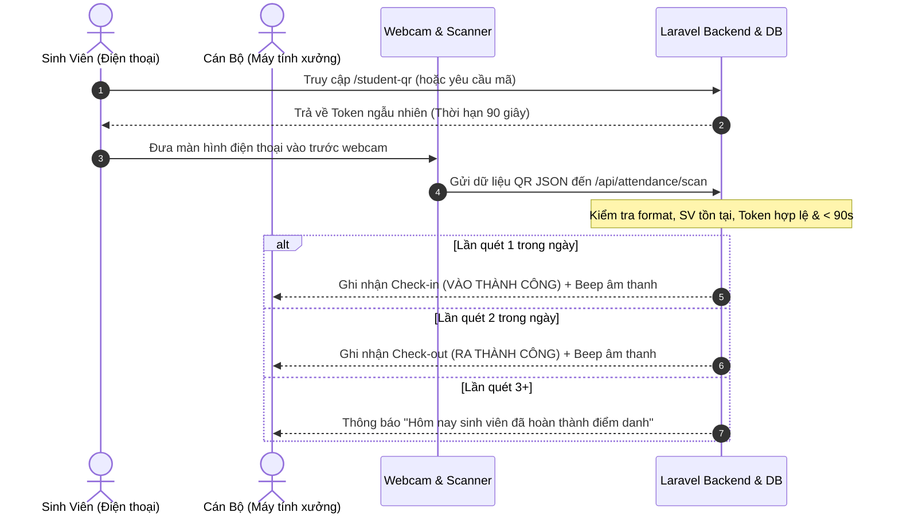

# ỨNG DỤNG ĐIỂM DANH SINH VIÊN BẰNG QR CODE CÁ NHÂN TẠI XƯỞNG THỰC HÀNH

> **Mục tiêu**: Hệ thống điểm danh sinh viên thông minh không dùng thiết bị IoT, không dùng Arduino/ESP32. Quét mã QR cá nhân của sinh viên bằng **Webcam máy tính** đặt tại cửa xưởng thực hành, tự động ghi nhận giờ vào và giờ ra, thống kê chuyên cần và xuất báo cáo Excel chuẩn mực.

---

## 1. TÍNH NĂNG NỔI BẬT

1. **Quét QR Code từ Webcam Máy Tính**:
   - Sử dụng camera webcam máy tính tại cửa xưởng để quét QR trực tiếp.
   - Chống quét liên tục (debounce) cùng 1 mã trong thời gian ngắn.
   - Âm thanh thông báo (Web Audio API) khi điểm danh thành công.
2. **Cơ chế QR Code Cá Nhân Bảo Mật 90 Giây**:
   - Mã QR chứa: `student_id`, `ma_sinh_vien`, `token` ngẫu nhiên và thời gian hết hạn.
   - **Token tự động hết hạn sau 90 giây**: Chống chụp ảnh gửi cho bạn bè điểm danh hộ.
   - Có trang hiển thị QR cá nhân cho sinh viên với đồng hồ đếm ngược trực quan và nút "Tạo mã mới".
3. **Quy Trình Điểm Danh Tự Động Thông Minh**:
   - Quét lần 1 trong ngày: Ghi nhận **Giờ Vào** (Check-in), trạng thái "Đang ở xưởng".
   - Quét lần 2 trong ngày: Ghi nhận **Giờ Ra** (Check-out), trạng thái "Hoàn thành".
   - Quét từ lần 3 trở đi: Thông báo "Hôm nay sinh viên đã hoàn thành điểm danh".
4. **Bảng Điều Khiển (Dashboard)**:
   - Thống kê: Tổng số sinh viên, số đã điểm danh hôm nay, số chưa điểm danh, lượt vào/ra.
   - Biểu đồ điểm danh 7 ngày gần nhất và tiến độ theo tuần.
5. **Quản Lý Sinh Viên**:
   - Thêm, sửa, xóa, tìm kiếm sinh viên theo tên, mã SV, lớp.
   - Bấm xem mã QR cá nhân 90s trực tiếp cho từng sinh viên.
6. **Thống Kê Chuyên Cần & Báo Cáo**:
   - Thống kê theo tuần, theo học kỳ (tổng số buổi, số buổi có mặt, số buổi vắng, tỷ lệ %).
   - **Xuất Báo Cáo Excel** (.xlsx) chuẩn mẫu qua **PhpSpreadsheet**.

---

## 2. CÔNG NGHỆ SỬ DỤNG

- **Backend**:
  - Laravel 11.x (PHP 8.3+)
  - RESTful API kiến trúc chuẩn
  - PhpSpreadsheet (Thư viện xuất file Excel .xlsx cao cấp)
  - Laravel Sanctum & Hash bảo mật mật khẩu
  - Hỗ trợ cả **MySQL** (khi chạy production/XAMPP) và **SQLite** (sẵn sàng chạy ngay).
- **Frontend**:
  - Vue.js 3 + Vite
  - Vue Router (SPA navigation)
  - Axios (HTTP Client)
  - `html5-qrcode` (Quét webcam thời gian thực)
  - `qrcode.vue` (Sinh QR mã sinh viên + token 90s)
  - Vanilla CSS hiện đại, Responsive.

---

## 3. CẤU TRÚC THƯ MỤC

```text
diem-danh-qr/
├── backend/                  # Laravel API
│   ├── app/
│   │   ├── Http/Controllers/Api/
│   │   │   ├── AuthController.php
│   │   │   ├── StudentController.php
│   │   │   ├── QrCodeController.php
│   │   │   ├── AttendanceController.php
│   │   │   ├── DashboardController.php
│   │   │   ├── ReportController.php
│   │   │   └── WorkshopController.php
│   │   └── Models/
│   │       ├── Student.php
│   │       ├── QrToken.php
│   │       ├── Attendance.php
│   │       ├── Workshop.php
│   │       └── User.php
│   ├── database/
│   │   ├── migrations/       # Tạo bảng students, workshops, qr_tokens, attendances, users
│   │   └── seeders/          # Seeder 10 sinh viên mẫu SV001-SV010, xưởng, cán bộ demo
│   └── routes/
│       └── api.php           # 25 REST API endpoints
└── frontend/                 # Vue 3 + Vite
    └── src/
        ├── views/
        │   ├── Login.vue             # Trang đăng nhập cán bộ
        │   ├── Dashboard.vue         # Bảng điều khiển & biểu đồ
        │   ├── QrScanner.vue         # Quét QR bằng webcam xưởng
        │   ├── StudentManagement.vue # Quản lý danh sách sinh viên
        │   ├── StudentDetail.vue     # Chi tiết sinh viên & lịch sử
        │   ├── StudentQr.vue         # Sinh viên xem QR 90s cá nhân
        │   ├── AttendanceHistory.vue # Lịch sử lượt vào/ra
        │   ├── Reports.vue           # Báo cáo chuyên cần & Xuất Excel
        │   └── WorkshopManagement.vue# Quản lý danh mục xưởng
        ├── services/
        │   └── api.js        # Axios instance kết nối backend
        └── style.css         # Hệ thống giao diện Clean UI
```

---

## 4. HƯỚNG DẪN CÀI ĐẶT & CHẠY

### Bước 1: Môi trường yêu cầu
- PHP >= 8.2 (đã có sẵn pdo_mysql, pdo_sqlite, gd, zip)
- Composer >= 2.x
- Node.js >= 18.x & npm

### Bước 2: Cài đặt và chạy Backend (Laravel)
1. Mở terminal tại thư mục `backend`:
   ```bash
   cd d:\diem-danh-qr\backend
   composer install
   ```
2. Cấu hình file `.env`:
   - Nếu dùng **MySQL** (XAMPP / Laragon):
     ```env
     DB_CONNECTION=mysql
     DB_HOST=127.0.0.1
     DB_PORT=3306
     DB_DATABASE=diem_danh_qr
     DB_USERNAME=root
     DB_PASSWORD=
     ```
     *(Tạo sẵn database tên `diem_danh_qr` trên phpMyAdmin/MySQL)*
   - Nếu chạy kiểm tra nhanh không cần bật MySQL: Sử dụng cấu hình mặc định SQLite:
     ```env
     DB_CONNECTION=sqlite
     ```
3. Chạy migration và nạp dữ liệu mẫu:
   ```bash
   php artisan migrate --seed
   ```
4. Khởi động server Backend (chạy cổng 8000):
   ```bash
   php artisan serve --port=8000
   ```
   *Backend API sẵn sàng tại: `http://127.0.0.1:8000`*

### Bước 3: Cài đặt và chạy Frontend (Vue 3 + Vite)
1. Mở terminal tại thư mục `frontend`:
   ```bash
   cd d:\diem-danh-qr\frontend
   npm install
   ```
2. Khởi động Frontend:
   ```bash
   npm run dev
   ```
3. Mở trình duyệt truy cập:
   👉 **`http://localhost:5173`**

---

## 5. TÀI KHOẢN & DỮ LIỆU DEMO (PHÂN QUYỀN 3 VAI TRÒ)

| Vai trò | Email / Tài khoản | Mật khẩu | Chức năng |
| :--- | :--- | :--- | :--- |
| **Quản trị viên (Admin)** | `admin@example.com` | `password` | Toàn quyền quản trị hệ thống, quản lý buổi thực hành, xưởng, sinh viên, báo cáo |
| **Giảng viên / Cán bộ xưởng** | `canbo@example.com` | `password` | Quản lý buổi thực hành, mở webcam quét QR điểm danh tại cửa xưởng, xem thống kê |
| **Sinh viên** | `sv001@example.com` (hoặc `SV001`) | `password` | Xem mã QR cá nhân 90 giây của chính mình, xem lịch sử điểm danh cá nhân |
| **Sinh viên mẫu khác** | `SV001` đến `SV010` | *(Mã SV)* | Lấy mã QR cá nhân 90s tại trang `/student-qr` |

---

## 6. DANH SÁCH REST API CHÍNH

| Method | Endpoint | Mô tả |
| :--- | :--- | :--- |
| `POST` | `/api/login` | Đăng nhập tài khoản |
| `GET` | `/api/dashboard` | Thống kê số lượng, biểu đồ 7 ngày & 4 tuần |
| `POST` | `/api/qr/generate` | Sinh token ngẫu nhiên và mã QR có thời hạn 90 giây |
| `POST` | `/api/attendance/scan` | Xử lý webcam quét QR: tự động vào / ra xưởng |
| `GET` | `/api/attendance` | Lịch sử điểm danh (hỗ trợ lọc ngày, lớp, mã SV) |
| `GET` | `/api/students` | Lấy danh sách và tìm kiếm sinh viên |
| `POST` | `/api/students` | Thêm sinh viên mới |
| `PUT` | `/api/students/{id}` | Cập nhật sinh viên |
| `DELETE`| `/api/students/{id}` | Xóa sinh viên |
| `GET` | `/api/reports/weekly` | Báo cáo chuyên cần theo tuần (tỷ lệ %) |
| `GET` | `/api/reports/semester` | Báo cáo chuyên cần theo học kỳ |
| `GET` | `/api/reports/export` | **Tải file Excel (.xlsx)** tạo bởi PhpSpreadsheet |
| `GET` | `/api/workshops` | Danh sách xưởng thực hành |

---

## 7. QUY TRÌNH HOẠT ĐỘNG THỰC TẾ TẠI XƯỞNG



---

## 8. HƯỚNG PHÁT TRIỂN TIẾP THEO

1. Gửi thông báo Email / Zalo tự động cho sinh viên khi quét vào và ra xưởng.
2. Tích hợp AI Face Matching kết hợp cùng QR Code để nâng cao bảo mật hai lớp.
3. Ứng dụng PWA (Progressive Web App) cài đặt biểu tượng trực tiếp trên điện thoại sinh viên.
